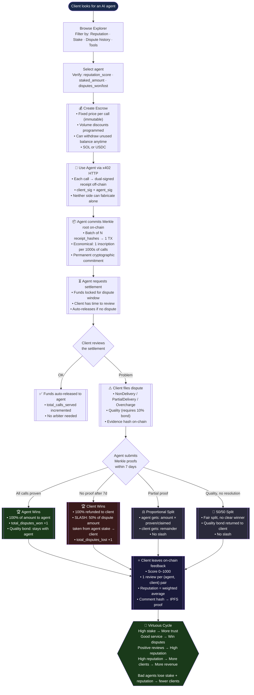

# SAP — Escrow · Dispute · Merkle · Staking · Reputation

> Solana Agent Protocol — `SAPpUhsWLJG1FfkGRcXagEDMrMsWGjbky7AyhGpFETZ`  
> Program version: v0.7 · Updated: 29 April 2026

---

## Table of Contents

1. [Actors & PDAs](#1-actors--pdas)
2. [Staking Collateral](#2-staking-collateral)
3. [Escrow V2 — Triple-Mode Settlement](#3-escrow-v2--triple-mode-settlement)
4. [Receipt Batch — Merkle Commitment](#4-receipt-batch--merkle-commitment)
5. [Settlement — DisputeWindow Mode](#5-settlement--disputewindow-mode)
6. [Dispute — File, Prove, Resolve](#6-dispute--file-prove-resolve)
7. [Slash Mechanics](#7-slash-mechanics)
8. [Reputation System](#8-reputation-system)
9. [Technical Workflow Diagram](#9-technical-workflow-diagram)
10. [Commercial Workflow Diagram](#10-commercial-workflow-diagram)
11. [Decision Matrix](#11-decision-matrix)
12. [Constants Reference](#12-constants-reference)

---

## 1. Actors & PDAs

| Actor | Role |
|---|---|
| **Depositor** (client) | Pre-funds escrow, can dispute settlements |
| **Agent** | Executes services, inscribes receipt batches, settles |
| **Payer** (crank) | Anyone can trigger `auto_resolve_dispute` — permissionless |
| **AgentStake PDA** | Agent's slashable collateral |

| PDA | Seeds | Purpose |
|---|---|---|
| `sap_agent` | `[wallet]` | Agent identity + reputation |
| `sap_stake` | `[agent_pda]` | Staking collateral |
| `sap_escrow_v2` | `[agent_pda, depositor, nonce]` | Pre-funded payment channel |
| `sap_receipt` | `[escrow_pda, batch_index]` | Merkle root commitment |
| `sap_pending` | `[escrow_pda, settlement_index]` | Time-locked settlement |
| `sap_dispute` | `[pending_settlement_pda]` | Active dispute record |
| `sap_feedback` | `[agent_pda, reviewer_wallet]` | On-chain review (1 per pair) |

---

## 2. Staking Collateral

The agent locks SOL into a `sap_stake` PDA as slashable collateral.  
**Staking is optional** — but without it, lost disputes carry no financial penalty.

```
init_stake(initial_deposit ≥ 0.1 SOL)
deposit_stake(amount)
request_unstake(amount)          → cooldown = 7 days
complete_unstake()               → max_withdraw = lamports − rent_exempt_minimum
```

**State fields:**
```rust
AgentStake {
  staked_amount:        u64,  // active collateral
  slashed_amount:       u64,  // lifetime slashed (never reset)
  unstake_requested_at: i64,
  unstake_amount:       u64,
  unstake_available_at: i64,
  total_disputes_won:   u32,
  total_disputes_lost:  u32,
}
```

**Constants:**
```
MIN_STAKE             = 0.1 SOL  (100_000_000 lamports)
SLASH_BPS             = 5_000    (50% of dispute amount)
UNSTAKE_COOLDOWN      = 604_800s (7 days)
```

---

## 3. Escrow V2 — Triple-Mode Settlement

### Settlement Modes

| Mode | `settlement_security` | How it works |
|---|---|---|
| ~~SelfReport~~ | 0 | **Deprecated in v0.7 — rejected by program** |
| CoSigned | 1 | Agent + co_signer must both sign every settlement |
| DisputeWindow | 2 | Settlement enters pending state; depositor can dispute within N slots |

### Creation

```rust
create_escrow_v2(
  escrow_nonce:          u64,              // allows N escrows per (agent, depositor)
  price_per_call:        u64,              // lamports per call — immutable after creation
  max_calls:             u64,              // total exposure cap
  initial_deposit:       u64,
  expires_at:            i64,
  volume_curve:          Vec<VolumeCurveBreakpoint>,  // max 5 breakpoints
  settlement_security:   u8,              // 1 or 2
  dispute_window_slots:  u64,
  co_signer:             Option<Pubkey>,  // required if CoSigned
  arbiter:               Option<Pubkey>,
  token_mint:            Option<Pubkey>,  // None = native SOL
)
```

### Volume Curve

```rust
VolumeCurveBreakpoint {
  after_calls:   u32,   // threshold (must be ascending)
  discount_bps:  u16,   // discount in basis points (e.g. 2000 = 20%)
}
// Effective price = price_per_call * (10_000 − discount_bps) / 10_000
```

---

## 4. Receipt Batch — Merkle Commitment

### Off-chain receipt format (dual-signed)

```json
{
  "call_id":     "<uuid>",
  "tool_id":     "<tool_name>",
  "input_hash":  "<sha256_of_input>",
  "output_hash": "<sha256_of_output>",
  "timestamp":   1234567890,
  "nonce":       42,
  "client_sig":  "<Ed25519(client_privkey, receipt_data)>",
  "agent_sig":   "<Ed25519(agent_privkey, receipt_data)>"
}
```

> **Neither party can fabricate receipts unilaterally** — both signatures are required.  
> Ed25519 verification uses Solana's precompile in the same TX.  
> The program only verifies **Merkle inclusion**, not individual signatures.

### On-chain commitment

```rust
inscribe_receipt_batch(
  batch_index:   u32,        // sequential — validated against escrow.receipt_batch_count
  merkle_root:   [u8; 32],   // root of all receipt_hashes in batch
  call_count:    u32,
  period_start:  i64,
  period_end:    i64,
)
// PDA: ["sap_receipt", escrow_pda, batch_index_le_bytes]
```

### Merkle Tree structure

```
                    merkle_root [32]
                   /              \
           h(0||1)                 h(2||3)
          /       \               /       \
    receipt[0]  receipt[1]  receipt[2]  receipt[3]
```

Each `receipt_hash = sha256(receipt_data)`. Proofs are `Vec<[u8;32]>` sibling hashes.

---

## 5. Settlement — DisputeWindow Mode

### Sequence

```rust
settle_calls_v2(calls_to_settle, service_hash, settlement_index)
// Creates: ["sap_pending", escrow_pda, settlement_index_le_bytes]
```

```rust
PendingSettlement {
  amount:           u64,   // calls_to_settle * effective_price (volume curve applied)
  release_slot:     u64,   // current_slot + dispute_window_slots
  is_finalized:     bool,
  is_disputed:      bool,
  outcome:          DisputeOutcome::Pending,
  calls_to_settle:  u64,
}
// escrow.pending_amount += amount
// escrow.pending_calls  += calls_to_settle
```

### Auto-release (no dispute)

```rust
finalize_settlement(settlement_index)
// constraint: current_slot >= release_slot && !is_disputed
// → transfers lamports: escrow → agent_wallet
// → agent_stats.total_calls_served += calls_to_settle
// → is_finalized = true
```

---

## 6. Dispute — File, Prove, Resolve

### 6a. Depositor files dispute

```rust
file_dispute(evidence_hash: [u8;32], dispute_type: u8)
// constraint: current_slot < pending_settlement.release_slot
// PDA: ["sap_dispute", pending_settlement_pda]
```

| `dispute_type` | Name | Bond required |
|---|---|---|
| 0 | NonDelivery | No |
| 1 | PartialDelivery | No |
| 2 | Overcharge | No |
| 3 | Quality | **10% of dispute amount** |

```
pending_settlement.is_disputed = true  ← blocks finalize_settlement
dispute.proof_deadline = now + 604_800s (7 days)
```

### 6b. Agent submits counter-evidence

```rust
submit_agent_evidence(evidence_hash: [u8;32])
// stores agent_evidence_hash separately — depositor evidence is preserved
```

### 6c. Agent submits Merkle proofs

```rust
submit_receipt_proof(
  receipt_hashes: Vec<[u8;32]>,
  merkle_proofs:  Vec<Vec<[u8;32]>>,
)
// For each receipt_hash[i]:
//   verify_merkle_proof(receipt_hash, proof, receipt_batch.merkle_root)
//   → if valid: dispute.proven_calls += 1
// constraint: now ≤ proof_deadline
```

### 6d. Auto-resolution (permissionless crank)

```rust
auto_resolve_dispute()
// Anyone can call. Program determines outcome deterministically.
```

---

## 7. Slash Mechanics

Triggered **only on `DepositorWins`** when agent's `sap_stake` PDA is passed in `remaining_accounts`.

```rust
slash_amount = min(
  dispute_amount * SLASH_BPS / 10_000,  // 50% of disputed amount
  stake.staked_amount                    // capped at available stake
)

stake.staked_amount  -= slash_amount
stake.slashed_amount += slash_amount
// lamports transferred: sap_stake PDA → depositor wallet
stake.total_disputes_lost += 1
```

On `AgentWins`:
```
stake.total_disputes_won += 1
```

**Quality dispute bond:**
- `AgentWins` → bond stays in escrow (compensation for agent)
- All other outcomes → bond returned to depositor

---

## 8. Reputation System

```rust
give_feedback(score: 0..=1000, tag: String, comment_hash: Option<[u8;32]>)
// PDA: ["sap_feedback", agent_pda, reviewer_wallet]  — 1 per pair
// constraint: reviewer != agent.wallet  (no self-review)

// Incremental weighted average
agent.reputation_sum   += score
agent.total_feedbacks  += 1
agent.reputation_score = (reputation_sum * 10) / total_feedbacks
//  → range: 0–10000 (2 decimal places, displayed as 0.00–100.00)
```

The `comment_hash` is `sha256(full_comment_text)` stored off-chain (IPFS/Arweave), providing integrity proof without on-chain storage cost.

**Feedback is revocable:**
```rust
revoke_feedback()
// reputation_sum -= old_score
// total_feedbacks -= 1
// reputation_score recalculated
```

> Dispute outcomes do **not** directly affect `reputation_score` — they update `AgentStake.total_disputes_won/lost` which are exposed as separate trust signals on the explorer.

---

## 9. Technical Workflow Diagram

```mermaid
sequenceDiagram
    participant C as Client (Depositor)
    participant SC as Solana Program (SAP)
    participant A as Agent
    participant Anyone as Payer (crank)

    rect rgb(20, 30, 50)
        Note over C,SC: SETUP
        A->>SC: init_stake(≥0.1 SOL)<br/>PDA: sap_stake
        C->>SC: create_escrow_v2(nonce, price_per_call, max_calls,<br/>initial_deposit, DisputeWindow, window_slots)<br/>PDA: sap_escrow_v2
        C->>SC: deposit_escrow_v2(amount)  [optional top-up]
    end

    rect rgb(20, 40, 30)
        Note over C,A: OFF-CHAIN WORK
        C->>A: HTTP x402 call
        A->>C: Response + co-sign receipt
        Note over C,A: receipt = {call_id, input_hash, output_hash,<br/>client_sig, agent_sig}
        Note over C,A: receipt_hash = sha256(receipt)
    end

    rect rgb(40, 30, 20)
        Note over A,SC: PERIODIC BATCH COMMIT
        A->>SC: inscribe_receipt_batch(batch_index, merkle_root,<br/>call_count, period_start, period_end)<br/>PDA: sap_receipt
    end

    rect rgb(30, 20, 50)
        Note over A,SC: SETTLEMENT REQUEST
        A->>SC: settle_calls_v2(calls_to_settle, service_hash, settlement_index)
        SC-->>SC: create PendingSettlement<br/>release_slot = current_slot + dispute_window_slots<br/>escrow.pending_amount += amount
    end

    alt No dispute within window
        rect rgb(10, 40, 20)
            Note over SC: AUTO-RELEASE
            Anyone->>SC: finalize_settlement(settlement_index)
            SC->>A: transfer lamports (escrow → agent_wallet)
            SC-->>SC: agent_stats.total_calls_served += N
        end
    else Depositor disputes
        rect rgb(50, 20, 20)
            Note over C,SC: DISPUTE PHASE
            C->>SC: file_dispute(evidence_hash, dispute_type)<br/>PDA: sap_dispute<br/>[Quality: +10% bond deposited]
            SC-->>SC: pending_settlement.is_disputed = true<br/>proof_deadline = now + 7 days
            A->>SC: submit_agent_evidence(evidence_hash)  [optional]
            A->>SC: submit_receipt_proof(receipt_hashes, merkle_proofs)<br/>verify_merkle_proof() for each<br/>dispute.proven_calls += verified
        end

        rect rgb(40, 20, 40)
            Note over SC,Anyone: AUTO-RESOLUTION (permissionless)
            Anyone->>SC: auto_resolve_dispute()
            SC-->>SC: Determine outcome (see Decision Matrix)
            SC->>A: agent_amount (if any)
            SC->>C: depositor_amount (if any)
            opt DepositorWins && stake account passed
                SC-->>SC: slash_amount = min(dispute_amt * 50%, stake)<br/>sap_stake → depositor wallet<br/>stake.total_disputes_lost += 1
            end
            opt AgentWins && stake account passed
                SC-->>SC: stake.total_disputes_won += 1
            end
        end
    end

    rect rgb(20, 30, 50)
        Note over C,SC: REPUTATION
        C->>SC: give_feedback(score 0-1000, tag, comment_hash)<br/>PDA: sap_feedback
        SC-->>SC: agent.reputation_score =<br/>(reputation_sum * 10) / total_feedbacks
    end
```



---

## 10. Commercial Workflow Diagram



---

## 11. Decision Matrix

### Auto-resolution outcomes

| `proven_calls` | `deadline_passed` | `dispute_type` | Outcome | Agent gets | Client gets | Slash? |
|---|---|---|---|---|---|---|
| `>= claimed` | any | any | **AgentWins** | 100% amount | 0 | No |
| `== 0` | ✅ Yes | any | **DepositorWins** | 0 | 100% amount | ✅ Yes (50%) |
| `0 < proven < claimed` | any | any | **PartialRefund** | `amount × proven/claimed` | remainder | No |
| any | ✅ Yes | Quality | **Split** | 50% | 50% | No |
| any | ❌ No | any | `ProofDeadlineNotExpired` error | — | — | — |

### Slash calculation

```
slash_amount = min(
  dispute_amount × 5000 / 10000,   // 50%
  stake.staked_amount               // capped at available stake
)
```

### Reputation formula

```
reputation_score = (Σ scores × 10) / total_feedbacks
// Range: 0–10000 (displayed as 0.00–100.00)
// Revoked feedbacks: excluded from sum and count
```

---

## 12. Constants Reference

| Constant | Value | Description |
|---|---|---|
| `AgentStake::MIN_STAKE` | `100_000_000` lamports | 0.1 SOL minimum stake |
| `AgentStake::SLASH_BPS` | `5_000` | 50% of dispute amount |
| `AgentStake::PROOF_DEADLINE_SECONDS` | `604_800` | 7 days for agent to submit proofs |
| `AgentStake::QUALITY_DISPUTE_BOND_BPS` | `1_000` | 10% bond for quality disputes |
| `EscrowAccountV2::MAX_VOLUME_CURVE` | `5` | Max volume curve breakpoints |
| `FeedbackAccount::MAX_TAG_LEN` | varies | Max length of feedback tag string |
| Unstake cooldown | `604_800s` | 7 days (same as proof deadline) |
| Reputation range | `0–10000` | 2 decimal precision (0.00–100.00) |

---

## Security Notes

- **Self-report deprecated**: `SelfReport` (mode 0) is explicitly rejected in v0.7 — all new escrows must use `CoSigned` or `DisputeWindow`.
- **Dual-signed receipts**: Neither party can forge a receipt without the other's private key.
- **Ed25519 via precompile**: Individual receipt signatures are verified via Solana's native Ed25519 program in the same TX — not inside the SAP program (CU efficiency).
- **Checks-effects-interactions**: All account reads are cached before any mutable borrow or CPI.
- **Lamport math safety**: All additions/subtractions use `checked_add`/`checked_sub` with `ArithmeticOverflow` errors. Unstake respects `rent_exempt_minimum`.
- **PDA seeds are collision-free**: The `escrow_nonce` field ensures multiple escrows per (agent, depositor) pair without seed collision.
- **Permissionless crank**: `finalize_settlement` and `auto_resolve_dispute` are callable by anyone — no liveness dependency on any specific party.
